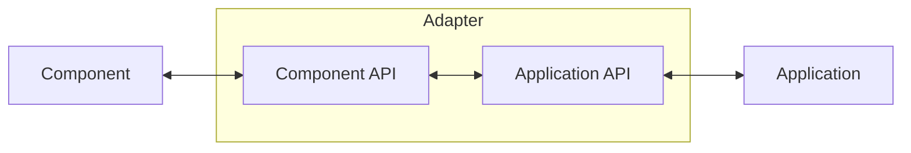

The [Adapter pattern](https://en.wikipedia.org/wiki/Adapter_pattern) allows an existing class's interface to be adapted to a different interface, acting as a bridge between incompatible interfaces. It converts a system's interface into the one needed, enabling compatibility with the client's requirements. Use this pattern when integrating a class with an incompatible interface, adapting an existing class to meet specific client expectations, or providing a wrapper to align an existing class with a new interface.



## Example

`OldPrinter` is an existing class with a method that needs adaptation, while `INewPrinter` is the target [interface](https://learn.microsoft.com/en-us/dotnet/csharp/language-reference/keywords/interface) expected by the client code. The `PrinterAdapter` [class](https://learn.microsoft.com/en-us/dotnet/csharp/language-reference/keywords/class) acts as the adapter, making `OldPrinter` compatible with `INewPrinter`.

```csharp
// Client code using the new interface
OldPrinter oldPrinter = new();
INewPrinter printer = new PrinterAdapter(oldPrinter);
printer.Print("Hello from Adapter Pattern!");

public class OldPrinter {
    public void PrintOld(string message) {
        Console.WriteLine($"[OldPrinter]: {message}");
    }
}

public interface INewPrinter {
    void Print(string message);
}

public class PrinterAdapter(OldPrinter oldPrinter) : INewPrinter {
    public void Print(string message) {
        Console.WriteLine("[New printer]: New functionality");
        oldPrinter.PrintOld(message);
    }
}
```

## Real world examples (bonus) 🎉

#### Example

The `Repository` [class](https://learn.microsoft.com/en-us/dotnet/csharp/language-reference/keywords/class) is an adapter of the [`DbContext`](https://learn.microsoft.com/en-us/dotnet/api/microsoft.entityframeworkcore.dbcontext?view=efcore-6.0) , which is a part of the [Entity Framework Core](https://learn.microsoft.com/en-us/ef/core/) framework.

```csharp
public class IRepository {
    // Interface methods
}

public class Repository(DataContext context) : IRepository {
    // CRUD operations
}

public class Service(IRepository repository) {
    // Business logic
}
```

#### Example

`TodosClient` is an adapter for the [`HttpClient`](https://learn.microsoft.com/en-us/dotnet/api/system.net.http.httpclient?view=net-7.0) API, designed to be used in the `Example` [Blazor](https://learn.microsoft.com/en-us/aspnet/core/blazor/) component to fetch data from the server.

`TodosClient` [`class`](https://learn.microsoft.com/en-us/dotnet/csharp/language-reference/keywords/class) is an adapter of the [`HttpClient`](https://learn.microsoft.com/en-us/dotnet/api/system.net.http.httpclient?view=net-7.0) API, used in the `Example` [Blazor](https://learn.microsoft.com/en-us/aspnet/core/blazor/) component for fetch data from the server.

```csharp
public interface IFetchable {
    // Interface methods
}

public class TodosClient(HttpClient client) : IFetchable {
    // HTTP operations
}

public class Example(IFetchable fetchable) : ComponentBase {
    // Presentation logic
}
```

## Combining adapters (bonus) 🎉

This code uses the [Adapter pattern](https://en.wikipedia.org/wiki/Adapter_pattern) to unify multiple adapters under a common [interface](https://learn.microsoft.com/en-us/dotnet/csharp/language-reference/keywords/interface). The `IAdapter` [interface](https://learn.microsoft.com/en-us/dotnet/csharp/language-reference/keywords/interface) defines the `Perform()` method expected by client code. `CacheService` and `HttpService` adapt existing components to this [interface](https://learn.microsoft.com/en-us/dotnet/csharp/language-reference/keywords/interface). `CombinedService` integrates both adapters, allowing their functionalities to be accessed through a single [interface](https://learn.microsoft.com/en-us/dotnet/csharp/language-reference/keywords/interface), thus providing a consistent way to interact with different services.

```csharp
public interface IAdapter {
    void Perform();
}

public class CacheService(HybridCache cache) : IAdapter {
    public void Perform() {
        throw new NotImplementedException();
    }
}

public class HttpService(HttpClient client) {
    public void Perform() {
        throw new NotImplementedException();
    }
}

public class CombinedService(IAdapter adapter1, IAdapter adapter2) : IAdapter {
    public void Perform() {
        // Combination logic...
        adapter1.Perform();
        adapter2.Perform();
        throw new NotImplementedException();
    }
}
```