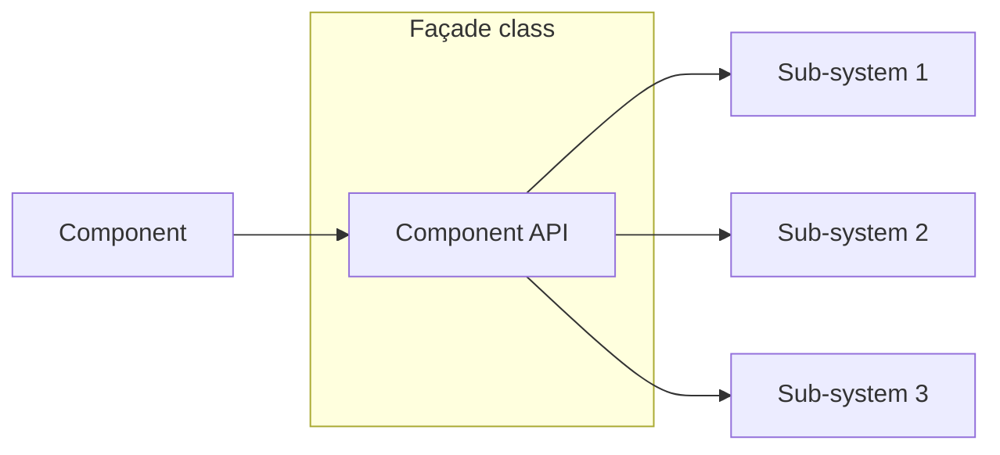

The [Façade pattern](https://en.wikipedia.org/wiki/Facade_pattern) simplifies complex systems by providing a unified interface over multiple interfaces, hiding the complexity of classes and subsystems behind a single, easy-to-use interface. It reduces dependencies between clients and intricate subsystems, balancing complexity and usability. This pattern allows users to interact with a sophisticated system through a straightforward API while still offering access to the underlying details if needed.Additionally, the full low-level API remains accessible when needed.




## Problem

Imagine you want to watch a movie. To get everything set up, you need to interact with three components: `AudioPlayer`, `VideoPlayer`, and `Projector`. Each component has its own set of methods, and you need to call these methods in a specific sequence to get the desired result. For example:

```csharp
AudioPlayer audioPlayer = new();
VideoPlayer videoPlayer = new();
Projector projector = new();

Console.WriteLine("Get ready to watch a movie...");
audioPlayer.Play();
videoPlayer.Play();
projector.On();
Console.WriteLine("Ending the movie...");
audioPlayer.Stop();
videoPlayer.Stop();
projector.Off();

// Very low level object
class AudioPlayer {
    public void Play() {
        Console.WriteLine("Playing audio...");
    }
    
    public void Stop() {
        Console.WriteLine("Stopping audio...");
    }
}

class VideoPlayer {
    public void Play() {
        Console.WriteLine("Playing video...");
    }
    
    public void Stop() {
        Console.WriteLine("Stopping video...");
    }
}

class Projector {
    public void On() {
        Console.WriteLine("Projector is on.");
    }
    
    public void Off() {
        Console.WriteLine("Projector is off.");
    }
}
```

## Solution

Essentially, we have low-level objects that are complex and not user-friendly for simple tasks like watching a movie. There's no need to interact with these detailed components or their complicated APIs directly. 

The `HomeTheaterFacade` [façade](https://en.wikipedia.org/wiki/Facade_pattern) simplifies interactions with these components by providing a unified [interface](https://learn.microsoft.com/en-us/dotnet/csharp/fundamentals/types/interfaces) for common operations, making the system much easier to use.

```csharp
HomeTheaterFacade homeTheater = new();
homeTheater.WatchMovie();
homeTheater.EndMovie();

class HomeTheaterFacade {
    private AudioPlayer _audioPlayer = new();
    private VideoPlayer _videoPlayer = new();
    private Projector _projector = new();

    public void WatchMovie() {
        Console.WriteLine("Get ready to watch a movie...");
        _audioPlayer.Play();
        _videoPlayer.Play();
        _projector.On();
    }

    public void EndMovie() {
        Console.WriteLine("Ending the movie...");
        _audioPlayer.Stop();
        _videoPlayer.Stop();
        _projector.Off();
    }
}
```

To improve the design and eliminate hidden dependencies, we can refactor the code for better loose coupling and explicit dependency management. Applying the [dependency inversion principle](https://en.wikipedia.org/wiki/Dependency_inversion_principle) would further enhance the design by ensuring high-level modules depend on abstractions, which was not initially done.

```csharp
AudioPlayer audioPlayer = new();
VideoPlayer videoPlayer = new(audioPlayer);
Projector projector = new(videoPlayer);

HomeTheaterFacade homeTheater = new(projector);
homeTheater.WatchMovie();
homeTheater.EndMovie();

class AudioPlayer {}

class VideoPlayer(AudioPlayer audioPlayer) {}

class Projector(VideoPlayer videoPlayer) {}

class HomeTheaterFacade(Projector projector) {
    public void WatchMovie() {
        Console.WriteLine("Get ready to watch a movie...");
    }

    public void EndMovie() {
        Console.WriteLine("Ending the movie...");
    }
}
```

In this case, while you're not reducing the dependencies between the client and the subsystems, you are still providing a simplified interface to the client. Using a dependency injection system can help manage these dependencies more effectively. 

## Real world example (bonus) 🎉

A real-world example of the [Façade pattern](https://en.wikipedia.org/wiki/Facade_pattern) can be found in [Entity Framework Core](https://learn.microsoft.com/en-us/ef/core/). You can access the `Database` through the façade of the [`DbContext`](https://learn.microsoft.com/en-us/ef/core/dbcontext-and-dbobject) class:

```csharp
public class BooksRepository(DataContext context) {
    public async Task<IEnumerable<Book>> GetAllBooksAsync() {
        return await context.Database
            .SqlQuery<Book>("SELECT * FROM Books")
            .ToListAsync(cancellationToken);
    }
}
``` 