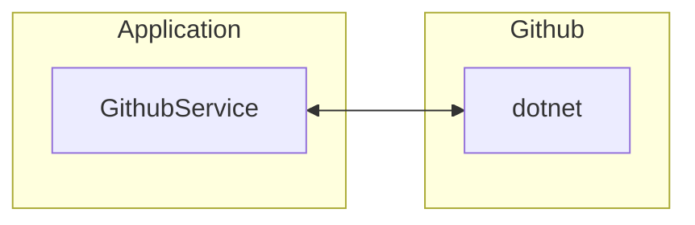
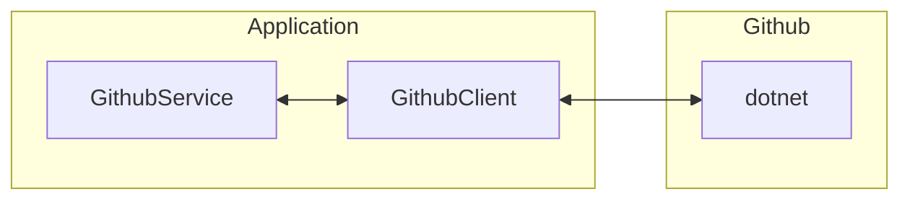

# [Dependency injection](https://www.youtube.com/watch?v=M1jxLQu40qo&list=PLl9nJmJjJzDyRPs2pWIRnk-O-44JrjeQn&index=14&t=6s)

```csharp
GithubService githubService = new();

var stars = githubService.GetStars("dotnet");

Console.WriteLine(stars);

public class GithubService {
    public int GetStars(string repoName) {
        return Random.Shared.Next(1, 1_000_000);
    }
}
```

In the previous snippet, a mocked service simulates interaction with the [GitHub API](https://docs.github.com/en/rest?apiVersion=2022-11-28). The [`class`](https://learn.microsoft.com/en-us/dotnet/csharp/language-reference/keywords/class) `GithubService` is used to generate fake data by returning a random number instead of real data.

The we instantiate a `GithubService`, and call `GetRepo` method to retrieve the number of stars for a given repository. However, instead of returning actual data, the method generates a random number, which doesn't reflect real-world usage. 

Here is how our system is structured:



To make things a bit more interesting and align with our goal, the previous code will be updated. A new `GithubClient` [`class`](https://learn.microsoft.com/en-us/dotnet/csharp/language-reference/keywords/class) will be added, which is responsible for handling communication with the API. The `GithubService` class will then use `GithubClient` instead of making API calls directly. The rest of the code will stay the same.

```csharp
public class GithubClient {
    public (string repoName, int Stars) GetRepo(string repoName) {
        var randomNumber = Random.Shared.Next(1, 1_000_000);
        return (repoName, randomNumber);
    }
}

public class GithubService {
    public int GetStars(string repoName) {
        return new GithubClient().GetRepo(repoName).Stars;
    }
}
```

Now, our system looks like this:



In this new approach, the `GetStars` method in `GithubService` creates a new instance of `GithubClient`, introducing a hidden dependency problem. To address this, we need to inject the `GithubClient` object into the constructor of `GithubService`. This change will resolve the implicit dependency issue and avoid potential problems.

```csharp
public class GithubClient {
    public (string repoName, int Stars) GetRepo(string repoName) {
        var randomNumber = Random.Shared.Next(1, 1_000_000);
        return (repoName, randomNumber);
    }
}

public class GithubService(GithubClient client) {
    public int GetStars(string repoName) {
        return client.GetRepo(repoName).Stars;
    }
}
```

With this change, we also need to update how we instantiate the classes:

```csharp
GithubClient newGitHubClient = new();

GithubService githubService = new(newGitHubClient);

var stars = githubService.GetStars("dotnet");

Console.WriteLine(stars);
```

This setup also creates a problem of tight coupling between `GithubService` and `GithubClient`, as `GithubService` directly relies on `GithubClient`. This makes it difficult to mock these classes, even when using [dependency injection](https://en.wikipedia.org/wiki/Dependency_injection#:~:text=Dependency%20injection%20aims%20to%20separate,how%20to%20construct%20those%20services.). The proper solution is to embrace the [[Dependency inversion (DIP)]] principle. The rest of the code will stay the same.

```csharp
public interface IGithubClient {
    (string repoName, int Stars) GetRepo(string repoName);
}

public class GithubClient : IGithubClient {
    public (string repoName, int Stars) GetRepo(string repoName) {
        var randomNumber = Random.Shared.Next(1, 1_000_000);
        return (repoName, randomNumber);
    }
}

public class GithubService(IGithubClient client) {
    public int GetStars(string repoName) {
        return client.GetRepo(repoName).Stars;
    }
}
```

## [Inversion of control](https://en.wikipedia.org/wiki/Inversion_of_control) and [Dependency injection](https://en.wikipedia.org/wiki/Dependency_injection)

[Inversion of control (IoC)](https://en.wikipedia.org/wiki/Inversion_of_control) is a design principle where you give some control of your system to a framework or container. In procedural or just traditional programming, you manage everything yourself, including object creation and dependencies, such as instantiating `GithubClient` within `GithubService`. For example, in [ASP.NET](https://dotnet.microsoft.com/en-us/apps/aspnet), you delegate much of the control to the framework, which handles tasks like creating controllers.

[Dependency injection (DI)](https://en.wikipedia.org/wiki/Dependency_injection) is a specific implementation of [Inversion of Control (IoC)](https://en.wikipedia.org/wiki/Inversion_of_control) that enhances code flexibility, modularity, testability, and maintainability. In [DI](https://en.wikipedia.org/wiki/Dependency_injection), concrete implementations of interfaces, like `IGithubClient`, are injected into classes such as `GithubService`, allowing the framework to manage dependencies externally rather than having the class create them internally.

## Types of [DI](https://en.wikipedia.org/wiki/Dependency_injection)

#### Constructor injection

```csharp
IGithubClient githubClient = new GithubClient();

GithubClient githubClient = new(githubClient);

public class GithubService(IGithubClient client) {
    // ...
}
```

#### Property injection

```csharp
GithubService githubService = new();

githubService.Client = new GithubClient();

public class GithubService {
    public IGithubClient? Client { get; set; }
}
```

#### Method injection

Where you instead of of initializing it during instantiation of the object
instead you have some setter method, that recieves the instance as a parameter
and set the field to that instance.

```csharp
GithubClient githubClient = new();

GithubService githubService = new();

githubService.SetGithubClient(githubClient);

public class GithubService {
    private IGithubClient? _client;

    public void SetGithubClient(IGithubClient client) {
        _client = client;
    }
}
```

#### Interface injection

You can defiine with an interface that you have the `SetGithubClient` method.

```csharp
interface IGithubClientSetter {
    void SetGithubClient(IGithubClient client);
}

public class GithubService : IGithubClientSetter {
    private IGithubClient? _client;

    public void SetGithubClient(IGithubClient client) {
        _client = client;
    }
}
```

## Utilizing the [.NET DI system](https://learn.microsoft.com/en-us/dotnet/core/extensions/dependency-injection)

First, we’ll return to the constructor injection approach. Instead of managing all [DI](https://en.wikipedia.org/wiki/Dependency_injection) manually throughout our application, in .NET, you typically use the built-in [IoC container](https://learn.microsoft.com/en-us/dotnet/core/extensions/dependency-injection).

You have to install this [NuGet package](https://www.nuget.org/packages/Microsoft.Extensions.DependencyInjection):

```shell
dotnet add package Microsoft.Extensions.DependencyInjection
```

Then rewrite the instantiation part as this:

```csharp
ServiceCollection serviceCollection = new();

// Register
serviceCollection.AddTransient<IGithubClient, GithubClient>();
serviceCollection.AddTransient<GithubService>();

var serviceProver = serviceCollection.BuildServiceProvider();

// GithubClient newGitHubClient = new();
// var githubService = new GithubService(newGitHubClient);
var githubService = serviceProver.GetRequiredService<GithubService>();

var stars = githubService.GetStars("dotnet");

Console.WriteLine(stars);
```

[`AddTransient`](https://learn.microsoft.com/en-us/dotnet/api/microsoft.extensions.dependencyinjection.servicecollectionserviceextensions.addtransient?view=net-8.0) indicates that every time the `IGithubClient` interface is requested, a new instance of `GithubClient` will be created. This means that when `GithubService` is requested, the service provider will create a new instance of `GithubService`, which in turn requires a new instance of `GithubClient` as it’s one of `GithubService`’s dependencies. Since `GithubClient` is defined as transient, a fresh instance is created each time and injected into `GithubService`.